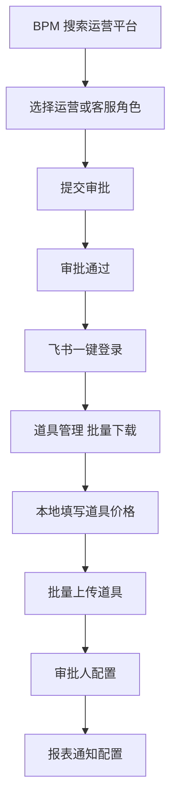
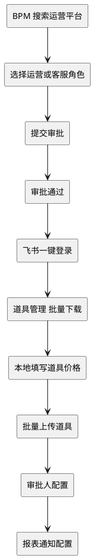
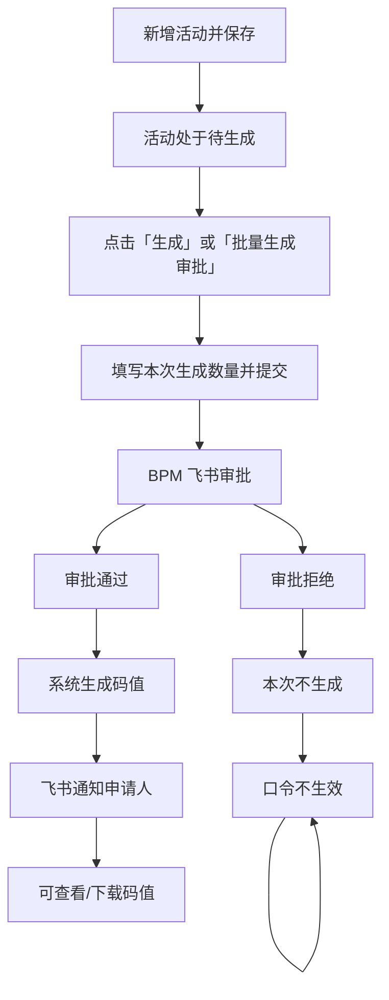
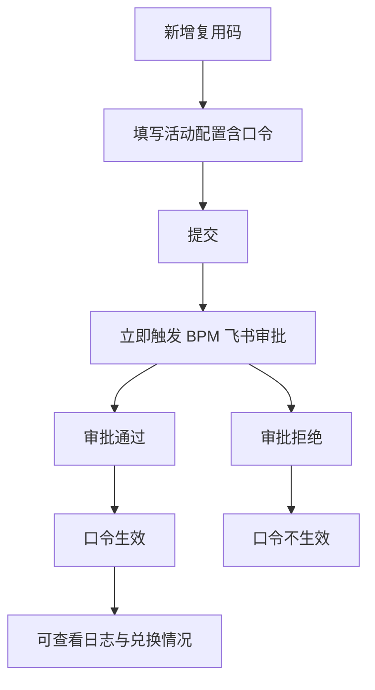

# 运营人员用户操作流程梳理

依据 [迅风兑换码-prd(1).md](迅风兑换码-prd(1).md) 与 [迅风兑换码-prototype.html](迅风兑换码-prototype.html)，运营人员的职责为：**创建/修改兑换码活动、发起 BPM 生成审批、管理道具定价**。整体流程分为**两大步骤**：**一、申请流程 + 基础配置**；**二、申请生成兑换码并走审批流**。以下先给出这两步的总流程图，再按章节展开细项。

---

## 一、用户操作流程总览（两大步骤）

### 第一大步骤：申请流程 + 基础配置

完成系统准入与基础数据、审批人配置、报表通知配置，为后续生成兑换码做准备。

### 第二大步骤：申请生成兑换码并走审批流

在系统内创建单人兑换码活动或复用兑换码活动，发起生成/创建并提交 BPM 审批，审批通过后码值或口令生效。

---

#### 单人兑换码（一码一人）

#### 复用兑换码（一码多人）

## 二、基础配置

### 2.1 道具管理

**关键点（首次使用系统）**：先**批量下载**道具列表或模板，在本地**填写完道具价格**后，再**批量上传**，完成道具与单价的初始化。

| 步骤 | 操作 | 说明 |
|------|------|------|
| 1 | 进入「道具管理」 | 为礼包配置与单码价值提供单价数据 |
| 2 | **批量下载** | 首次使用时，点击「导出」/「下载模板」等，批量下载当前道具列表或标准模板（含类型ID、类型名称、物品ID、物品名称、最大数量等列，价格列留空或可编辑） |
| 3 | **本地填写价格** | 在 Excel 中填写各道具的「价格（元）」等必填项，保存文件 |
| 4 | **批量上传** | 点击「批量上传」→ 选择已填好的 Excel → 系统解析预览 → 确认写入（格式错误行标红提示） |
| 5 | **日常维护** | 单条「新增」、操作列「修改」/「删除」；删除不影响已被活动引用的价格快照 |

**结果**：道具表维护完成，后续创建活动时从该表选道具并填数量，系统自动计算「单码价值」，供 BPM 审批预算使用。

### 2.2 审批人配置

审批人配置以**一个表**展示，每行对应一个审批层级（第一行一级审批人、第二行二级审批人）。

| 列表字段 | 说明 |
|----------|------|
| 角色 | 第一行：一级审批人；第二行：二级审批人 |
| 人员 | 飞书英文名，手动填写；可配置多人，多人为或签关系（任一人审批即通过该层级） |
| 操作 | 编辑（点击后弹窗内维护该层级人员名单，可新增/删除/修改飞书英文名） |

**第三步**：维护**审批人配置**，确保兑换码生成/复用码创建等 BPM 审批能正确路由到对应审批人（对接飞书审批流）。

| 步骤 | 操作 | 说明 |
|------|------|------|
| 1 | 进入「审批人配置」 | 侧栏入口：基础配置 → 审批人配置 |
| 2 | 维护审批人 | 点击操作列「编辑」，在弹窗内维护该层级人员名单（可新增/删除/修改飞书英文名），同一层级多人按或签处理 |
| 3 | 保存/生效 | 弹窗内保存后，后续发起的生成审批将按新配置走审批流程 |

**结果**：审批人配置就绪，运营发起生成或新增复用码时，BPM 审批单会提交给正确的审批人，审批通过后飞书通知申请人。如不配置则无法进入审批流程。

### 2.3 报表通知配置

配置**报表通知群**后，可选择**每日 / 每周 / 每月**接收「兑换码生成统计」与「变更记录」的推送。

| 步骤 | 操作 | 说明 |
|------|------|------|
| 1 | 进入「报表通知配置」 | 侧栏入口：基础配置 → 报表通知配置 |
| 2 | 配置报表通知群 | 选择或绑定飞书群，作为接收报表与变更记录的目标群 |
| 3 | 选择接收频率 | 勾选 **每日** / **每周** / **每月**，系统按所选频率向该群推送兑换码生成统计及后台变更记录 |

**结果**：配置保存后，报表通知群将按所选频率收到兑换码生成统计和变更记录，便于考核与审计追溯。

---

## 三、单人兑换码（一码一人）流程

### 3.1 活动列表与审批记录

- **活动列表** Tab：筛选（活动名称、创建人、活动状态、用途）→ 查询/重置；支持勾选多活动做「批量生成审批」。
- **审批记录** Tab：查看所有批量生成申请（申请单名称、申请时间、申请人、关联活动数、审批状态）→「查看详情」弹窗（各活动预计/实际生成数量、补充生成入口）。

### 3.2 新增活动 → 待生成

| 步骤 | 操作 | 说明 |
|------|------|------|
| 1 | 点击「新增活动」 | 打开活动配置弹窗 |
| 2 | 填写必填项 | 渠道、版本、开始/结束时间、活动标题、礼包配置（从道具管理选道具+数量）、用途（含二级：免费活动/创作者激励/售卖） |
| 3 | 选填 | 兑换上限、循环周期、单向排斥活动、备注；单码价值自动计算只读 |
| 4 | 保存 | 活动进入「待生成」，尚未产生码值 |

### 3.3 生成码值（发起 BPM 审批）

**方式 A：单活动生成**

| 步骤 | 操作 | 说明 |
|------|------|------|
| 1 | 在活动操作列点击「生成」 | 打开生成表单 |
| 2 | 填写「本次生成数量」 | 本次预计生成价值、总计生成价值自动计算 |
| 3 | 提交 | 生成**一条**飞书审批单（活动信息 + 本次生成信息） |

**方式 B：批量生成**

| 步骤 | 操作 | 说明 |
|------|------|------|
| 1 | 在活动列表勾选多个活动 | 点击「批量生成审批」 |
| 2 | 为每个活动填写本次生成数量 | 汇总为一条审批单 |
| 3 | 提交 | 生成**一条**飞书审批（汇总信息 + 各活动明细）；通过后按明细为每个活动分别生成码值 |

**审批结果**：通过 → 生成对应数量码值、飞书通知申请人；拒绝 → 本次不生成、飞书通知申请人。

### 3.4 审批流程参考汇总

一条单人兑换码生成审批单可用如下一句式汇总，便于审批单标题/摘要、报表通知或审批记录 Tab 的「查看详情」等场景使用。

**汇总模板：**

> 申请人 {申请人} 于 {申请时间} 申请生成单人兑换码，共 {活动数} 个活动，本单总生成 {本单总生成码数} 个码，总预计生成价值（商业化）¥{金额} 元。

| 占位符 | 说明 |
|--------|------|
| 申请人 | 发起生成审批的运营账号 |
| 申请时间 | 提交审批的时间 |
| 活动数 | 本单关联的活动数量（单活动生成=1，批量生成=勾选数） |
| 本单总生成码数 | 本单各活动「本次生成数量」之和 |
| 金额 | 本单总预计生成价值（商业化），元 |

**参考示例：**

> 申请人 Jay.zhu 于 2026-03-06 10:30 申请生成单人兑换码，共 3 个活动，本单总生成 12,000 个码，总预计生成价值（商业化）¥240,000 元。

### 3.5 查看与下载码值

| 步骤 | 操作 | 说明 |
|------|------|------|
| 1 | 活动操作列点击「查看码值」 | 打开码值弹窗 |
| 2 | 可选：生成批次、禁用状态筛选 | 默认批次「全部」 |
| 3 | Tab 切换 | **全部** / **未兑换列表**：仅该批次生成人本人可查看与下载；**兑换列表**：所有运营可查看，且不受批次筛选影响，始终为本活动全部已兑换记录 |
| 4 | 下载 | 导出当前 Tab 的 Excel；下载日志所有人可见 |

### 3.6 修改活动

- **未有审批中 / 已生成状态的记录**：所有字段可改。
- **有审批中 / 已生成状态的记录**：除「礼包配置」「用途」外可改（如标题、时间、区服、渠道、版本、备注等）。
- 修改权限不限于本人，任何运营均可修改。

### 3.7 复制活动

- 操作列「复制」→ 新活动携带除码值外的全部配置，标题自动加「(复制)」→ 新活动为「待生成」，需单独发起生成申请。

---

## 四、复用兑换码（一码多人）流程

### 4.1 新增即审批

| 步骤 | 操作 | 说明 |
|------|------|------|
| 1 | 点击「新增复用码」 | 打开活动配置弹窗 |
| 2 | 填写 | 渠道、版本、开始/结束时间、活动标题、**兑换码口令**、礼包配置、可兑换次数（0 或空=不限）、用途、备注；单码价值自动计算 |
| 3 | 提交 | **立即触发 BPM 审批**（无单独「生成」步骤） |

**审批结果**：通过 → 口令生效；拒绝 → **口令不生效**。

### 4.2 审批流程参考汇总

一条复用兑换码创建审批单可用如下一句式汇总，展示在审批单标题/摘要或查看详情时，且**汇总置于活动信息之上**。

**汇总模板：**

> 申请人 {申请人} 于 {申请时间} 申请创建复用兑换码，活动标题「{活动标题}」，口令 {口令}，单码价值（商业化）¥{金额} 元。

| 占位符 | 说明 |
|--------|------|
| 申请人 | 发起创建审批的运营账号 |
| 申请时间 | 提交审批的时间 |
| 活动标题 | 本复用码活动标题 |
| 口令 | 兑换码口令 |
| 金额 | 单码价值（商业化），元 |

**参考示例：**

> 申请人 Jay.zhu 于 2026-03-06 11:00 申请创建复用兑换码，活动标题「春季拉新口令」，口令 ABC2026，单码价值（商业化）¥20 元。

### 4.3 查看与修改

| 操作 | 说明 |
|------|------|
| 查看日志 | 操作列「查看日志」→ 弹窗内：**审批流程参考汇总**（见上）置于上方，其下为活动信息、兑换日志（可按角色ID筛选）、审批信息（状态、时间、飞书链接） |
| 修改 | 审批中/已同意：可改活动标题、渠道、版本、时间、备注；**口令、礼包配置、单码价值、可兑换次数、用途**锁定 |
| 复制 | 配置复制但**口令清空**，需重新填写口令后提交，再次触发 BPM 审批 |

---

## 五、单码查询（运营与客服共用）

运营和客服在单码查询页除查询外，还可做**单条/批量**禁用与解禁。

### 5.1 单人兑换码查询

| 步骤 | 操作 | 说明 |
|------|------|------|
| 1 | 填写任一条件 | 码值 / 角色 ID / 角色名称（精确或模糊） |
| 2 | 点击「查询」 | 展示活动信息（3 列 grid）+ 兑换日志表格 |
| 3 | 单条操作 | 在兑换日志操作列对单条码值「禁用」或「解禁」 |

### 5.2 批量上传（入口在单码查询 · 单人兑换码查询页）

| 操作 | 说明 |
|------|------|
| 批量上传查询 | 下载模板 → 上传含「兑换码」列的 Excel → 结果弹窗展示共 N 条、已禁用 X 条、正常 Y 条，可导出结果 |
| 批量上传禁用 | 上传含兑换码列的 Excel → 对**全部单人兑换码活动**中匹配的码值批量标记为已禁用 |
| 批量上传解禁 | 上传含兑换码列的 Excel → 对系统中已禁用的匹配码值批量解禁 |

### 5.3 复用兑换码查询

- 仅支持**口令精确查询** → 展示活动信息 + 兑换日志（可按角色 ID 筛选）；无批量禁用/解禁。

---

以上即为运营人员在迅风兑换码管理后台的完整用户操作流程梳理，可直接用于产品说明、培训或开发验收对照。
